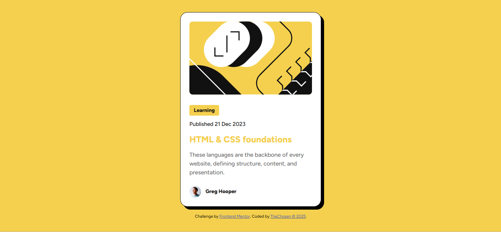

# Frontend Mentor - Blog preview card solution

This is a solution to the [Blog preview card challenge on Frontend Mentor](https://www.frontendmentor.io/challenges/blog-preview-card-ckPaj01IcS). It is a responsive blog preview card built with HTML and CSS. The design is based on a Frontend Mentor challenge and showcases a clean, modern layout with hover effects and mobile responsiveness. It’s a great exercise in mastering layout, typography, and component styling.

## Table of contents

- [Overview](#overview)
  - [Screenshot](#screenshot)
  - [Live Demo and Links](#live-demo-and-links)
- [My process](#my-process)
  - [Built with](#built-with)
  - [Layout Features](#layout-features)
  - [Folder Structure](#-folder-structure)
- [Author](#author)
- [Credits](#credits)
- [License](#license)

## Overview

### 📸 Screenshot

### 🚀 Live Demo and Links

- Solution URL: [https://github.com/Ayanfe8/blog-preview-card](https://github.com/Ayanfe8/blog-preview-card)
- Live Demo URL: You can view the live version of the project [https://ayanfe8.github.io/QR-Code-Component/](https://ayanfe8.github.io/QR-Code-Component/)

## My process

### 🛠️ Built with

- HTML5
- CSS3
- Google Fonts (Figtree)

### 📐 Layout Features

- Responsive layout for desktop and mobile
- Hover effect on card and title
- Semantic HTML structure
- Accessible alt text and clean typography
- Custom illustration and avatar

### 📁 Folder Structure

qr-code-component/
├── index.html
├── style.css
├── assets/
| ├── fonts
| └── images/
│   ├── favicon.png
│   ├── image-avatar.png
|   ├── illustration-article.svg
│   └── blog-preview-card-screenshot.jpg
└── README.md

## Author

- Website - [TheChosen](https://github.com/Ayanfe8)
- Frontend Mentor - [@Ayanfe8](https://www.frontendmentor.io/profile/Ayanfe8)

## ✨ Credits

Design provided by Frontend Mentor.
Built by Ayanfe — aspiring front-end developer.Acknowledgments

## 📄 License

This project is open-source and available under the MIT License.

---
